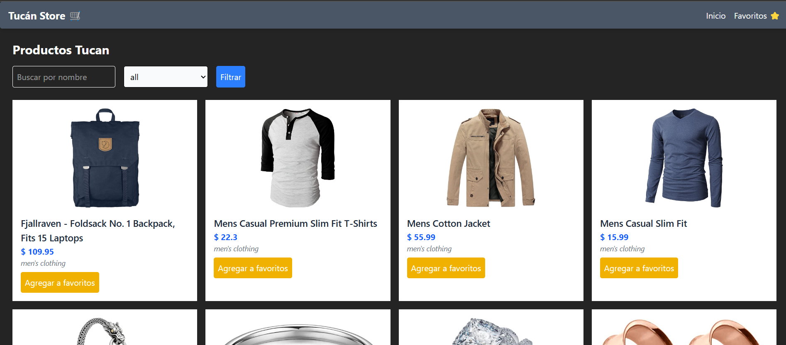
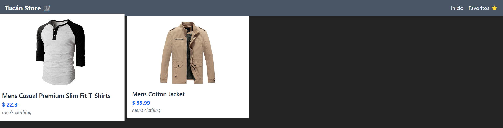

# 🛍️ Tucán Store

¡Bienvenido a **Tucán Store**!  
Una tienda virtual desarrollada con **Vite + React + TailwindCSS**, que consume la API de [FakeStoreAPI](https://fakestoreapi.com/) y permite a los usuarios explorar productos, filtrarlos por categoría y agregar sus favoritos.

🚀 Sitio en producción: [https://morant901.github.io/tucan-store](https://morant901.github.io/tucan-store)

---

## 📸 Capturas

  


---

## 🧠 Funcionalidades

-   🔍 **Filtrado por categoría y nombre**
-   ❤️ **Agregar y eliminar productos favoritos** (persistencia con `localStorage`)
-   ⚡ **Diseño responsivo con TailwindCSS**
-   📦 **Consumo de API externa con `fetch`**
-   🧭 **Navegación con React Router**
-   💡 **Código limpio y componentes reutilizables**

---

## 🛠️ Tecnologías

-   [Vite](https://vitejs.dev/)
-   [React](https://reactjs.org/)
-   [TypeScript](https://www.typescriptlang.org/)
-   [TailwindCSS](https://tailwindcss.com/)
-   [React Router](https://reactrouter.com/)

---

## 🧑‍💻 Sobre mí

Hola, soy **Diego Andrés Morant Acosta**.  
Soy desarrollador Frontend con experiencia en **React**, **VTEX IO** y creación de experiencias mágicas ✨ tanto en código como en persona (¡sí, también soy mago!).

Creo productos digitales que conectan con las personas, combinando tecnología, diseño y un toque humano.  
Si te gustó este proyecto y quieres trabajar conmigo o necesitas ayuda en el desarrollo de tu app...

📬 **Contáctame:**

-   ✉️ d.morant@hotmail.com
-   📱 +57 305 216 2655
-   💼 [LinkedIn](https://www.linkedin.com/in/diegomorant/)
-   📸 [Instagram (Magia)](https://www.instagram.com/morant_ilusionista/)

---

## 🧾 Instalación

```bash
git clone https://github.com/morant901/tucan-store.git
cd tucan-store
npm install
npm run dev
```

---

## 🎯 Objetivo del proyecto

Este proyecto fue desarrollado como una prueba técnica y ejercicio personal para demostrar el consumo de APIs, gestión de estado local y buenas prácticas con React. También es un ejemplo funcional de cómo estructurar un proyecto profesional con **componentes reutilizables**, **ruteo limpio** y **estilos modernos**.

---

¿Te gustó el proyecto? ¡Dale una ⭐ o contáctame para colaborar juntos!
